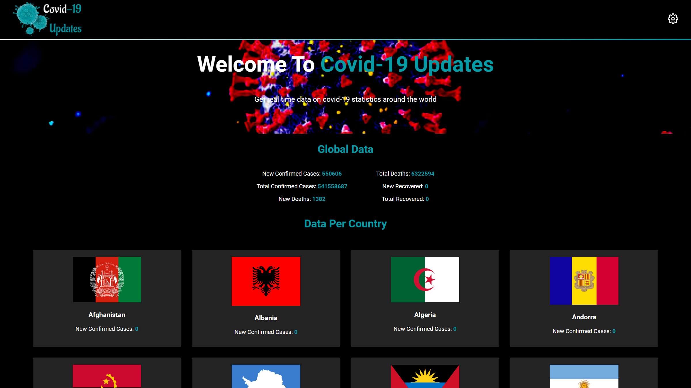
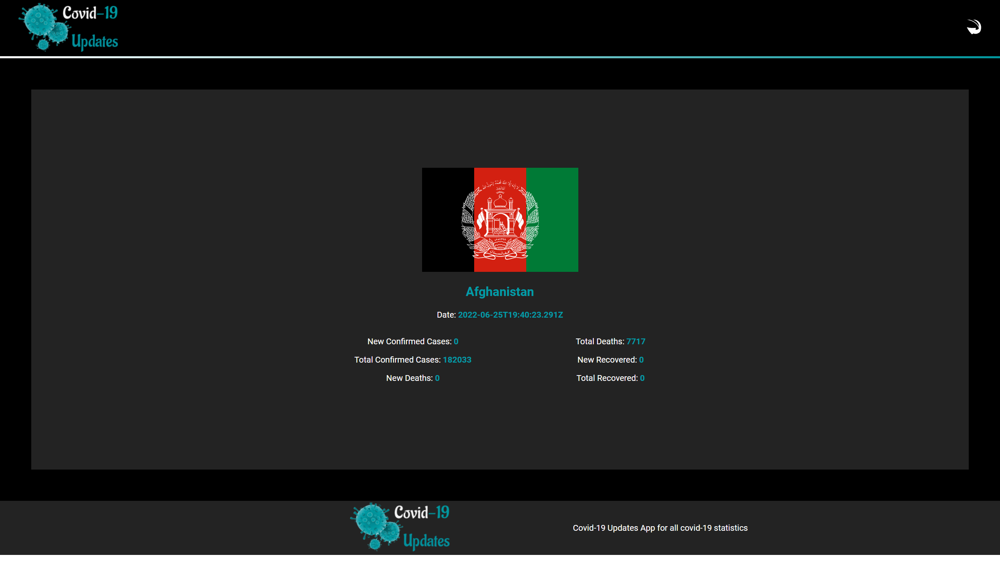

# Covid-19 Updates App


> This webapp provides Covid-19 statistics and updates using the data it gets from an [API data source](https://api.covid19api.com/) to provide comprehensive information about the novel coronavirus, 
> 
It is created with [Create-React-App](https://github.com/facebook/create-react-app)

---

## Screenshot
| Homepage |   Continent Page |
| ---------- | ----------- |
 |  |  |
</p>


## Live version

For the live version of this project visit the following [Netlify](https://covid-19-updates-hub.netlify.app/) link.

## Get started

```bash
   git clone https://github.com/Theophileaseh/Covid-19-Updates.git
   cd into the folder by typing: cd Covid-19-Updates
```

 ## Technology

- React-Create-App
- React-DOM
- Redux
- npm
- Javascript ES6
- Nodejs
- HTML && CSS
- React

## Authors

👤 **Nwachan Theophile**

- GitHub: [@Theophileash](https://github.com/Theophileaseh)
- Twitter: [@NwachanT](https://twitter.com/NwachanT)
- LinkedIn: [LinkedIn](https://linkedin.com/in/nwachan-theophile)

## Acknowledgments

- [Microverse](https://www.microverse.org/)
- External API from https://api.covid19api.com/
- Original design idea (Ballhead App (Free PSDs)) by Nelson Sakwa [Website](https://www.behance.net/gallery/31579789/Ballhead-App-(Free-PSDs))

## 🤝 Contributing
All contributions, issues and feature requests are welcome!

1. Fork it (https://github.com/Theophileaseh/Covid-19-Updates.git)
2. Create your working branch (git checkout -b [choose-a-name])
3. Commit your changes (git commit -am 'what this commit will fix/add/improve')
4. Push to the branch (git push origin [chosen-name])
5. Create a new Pull Request

## Show your support:

Give a :star: if you liked the app

# License
This project is [MIT](LICENSE.md) licensed.
